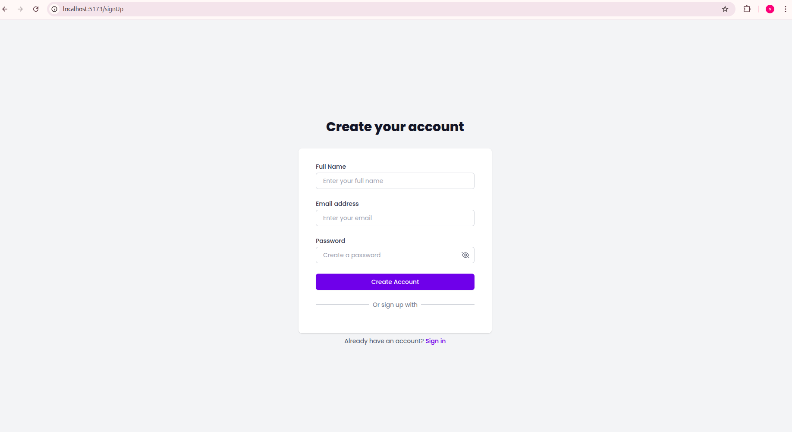
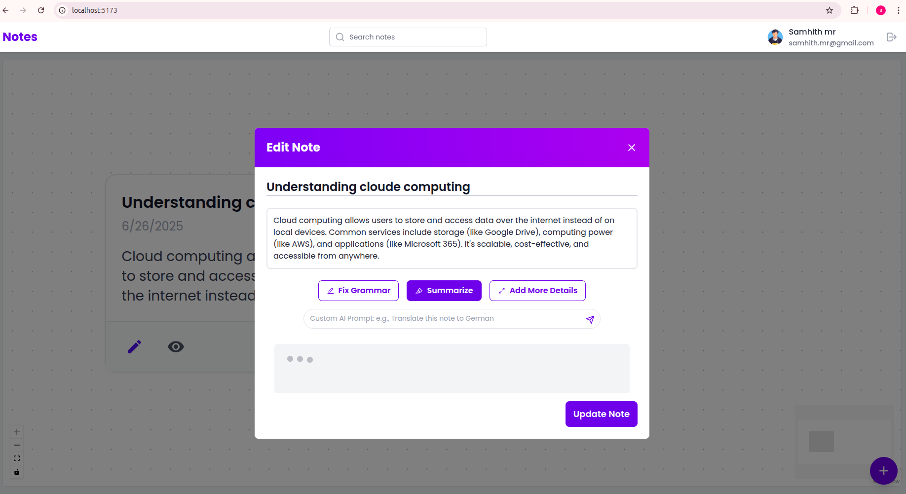
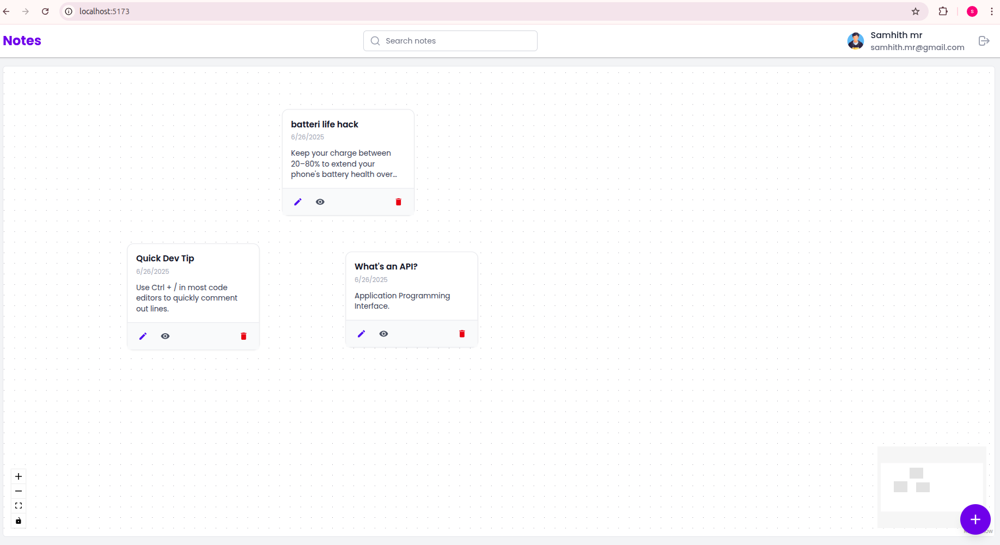

# NotesApp

An AI-powered full-stack note-taking application featuring a draggable interactive canvas, note CRUD operations, and AI-enhancements for grammar, summaries, and content expansion.


## Features

- **Interactive Canvas**: Drag and position notes freely; positions persist between sessions.
- **User Authentication**: Secure login and sign-up system
- **AI Enhancements**: Improve grammar, generate summaries, expand note content and custom prompt by users using AI.
- **Real-time Updates**: Notes and positions sync instantly using sockets.
- **Note Management**:
  - Create notes with title and content
  - Update and delete existing notes
- **Dashboard**: 
  - Navigation bar with app name, search functionality, and user profile
  - Note display area
  - Add note button (bottom right)
- **Responsive Design**: Optimized for various screen sizes
- **Note Management**: Create, update, delete notes with title and content.
- **Responsive UI**: Built with React and React Flow for a clean, intuitive experience.


## Environment Variables

To run this project, you will need to add the following environment variables to your .env file:

### Backend
    MONGODB_URI=your_mongodb_connection_string
    ACCESS_TOKEN_SECRET=your_backend_api_url
    OPENROUTER_API_KEY=your opnerouter api key

### Frontend
    VITE_BASE_URL=your_backend_api_url


## Technologies Used

### Backend
- Node.js, Express
- MongoDB (with Mongoose)
- Socket.io (real-time communication)
- JSON Web Token (JWT) for authentication
- Cors for cross-origin resource sharing
- Dotenv for environment variable management
- Bcrypt for password hashing

### Frontend
- React.js
- TailwindCSS
- Context API
- React Router for navigation
- Axios for API requests
- Moment.js for date formatting
- React Icons for UI icons
- React Modal for pop-up forms
- React (hooks)
- React Flow (interactive canvas)
- Axios, React Router, React Icons, React Modal

### Database
- MongoDB


## Installation

1. Clone the repository:
```bash
git clone git@github.com:SamhithMR/note_app.git && cd notes-app
```
2. Install server dependencies:
```bash
cd server && npm install
```
3. Install frontend dependencies:
```bash
cd ../client && npm install
```

4. Set up environment variables:
- Create a `.env` file in the server directory and add environment variables
- Create a `.env` file in the client directory and add environment variables

## Usage

1. Start the backend server:
```bash
cd server && npm start
```
2. In a new terminal, start the frontend development server:
```bash
cd client && npm run dev
```
3. Open your browser and navigate to `http://localhost:5173` (or the port specified by your React app)


## reference images




